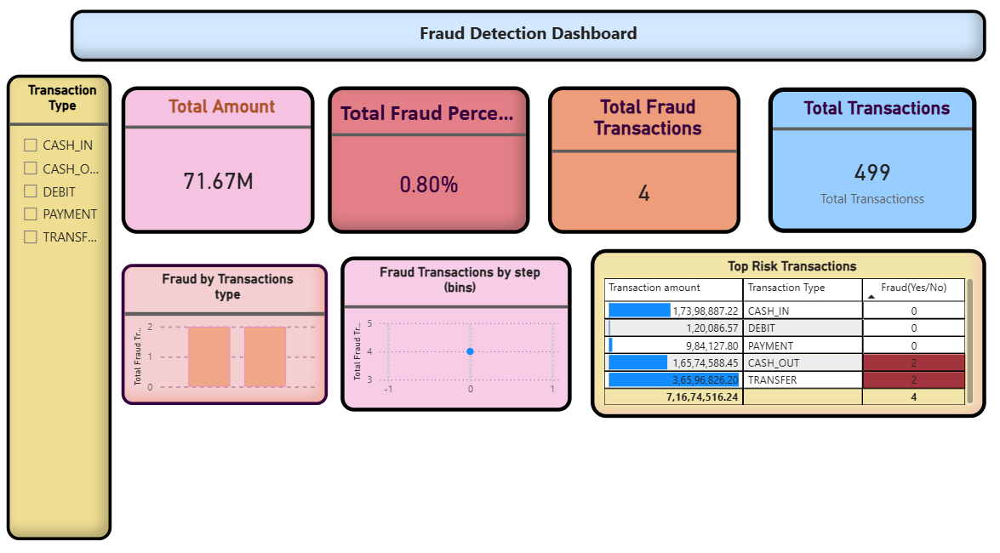

# 🚨 Fraud Detection Analysis (MySQL + Power BI)

## 📊 Overview
This project focuses on analyzing financial transaction data to detect fraudulent activities using MySQL for data analysis and Power BI for visualization.

## 🎯 Objective
- Identify fraudulent transactions
- Analyze fraud patterns by transaction type
- Detect high-risk transactions
- Visualize trends using interactive dashboard
- 
## 🛠 Tools Used
- MySQL (Data cleaning and Analysis)
- Power BI (Dashboard and Visualization)
- DAX (Data Analysis Expressions)
- Csv(Dataset)

##  Dataset Description

The dataset contains transaction-level information:

* Transaction type
* Amount
* Sender & Receiver
* Account balances
* Fraud indicators (`isFraud`, `isFlaggedFraud`)
  
##  Data Cleaning

* Checked for missing values
* Removed duplicate records
* Validated transaction amounts
* Identified balance mismatches
* Ensured data consistency

##  Exploratory Data Analysis (EDA)

* Calculated total transactions and fraud percentage
* Analyzed fraud distribution by transaction type
* Compared actual fraud vs system-flagged fraud
* Studied time-based patterns using step
* Identified top fraudulent users
* Analyzed transaction amount behavior

## 💡 Features
- KPI Cards (Total Transactions, Fraud Count, Fraud %)
- Fraud Trend Analysis (Line Chart)
- Fraud by Transaction Type (Bar Chart)
- Top Risk Transactions Table
- Interactive Filters (Slicers)

## 📊 Dashboard Preview

## 🔍 Key Insights

### 1. Fraud is Rare but Critical

* Fraud rate ≈ **0.8%**
* Highly imbalanced dataset

👉 Fraud detection becomes challenging due to low occurrence

### 2. Fraud Concentration

* Fraud is higher in specific transaction types

👉 High-risk transaction types require monitoring

### 3. Detection System Gap

* Many fraud cases are not flagged (`isFlaggedFraud = 0`)

👉 Indicates inefficiency in detection logic

### 4. Amount Alone is Not Enough

* High-value transactions are not always fraud

👉 Multiple factors are needed for detection

### 5. Repeated Fraud Users

* Some users perform multiple fraudulent transactions

👉 These users should be monitored or blocked

### 6. Time-Based Patterns

* Fraud varies across different time steps

👉 Suggests need for real-time monitoring

### 7. Data Anomalies

* Balance mismatches observed in some transactions

👉 Indicates potential suspicious activity

## 💡 Recommendations

* Improve fraud detection rules to reduce false negatives
* Monitor high-risk transaction types
* Implement real-time fraud alerts
* Track and block suspicious users
* Use advanced techniques like anomaly detection

## 🎯 Conclusion

Fraud detection is a challenging problem due to the highly imbalanced nature of the data. Effective detection requires pattern analysis, improved system logic, and real-time monitoring rather than relying on simple rules.

